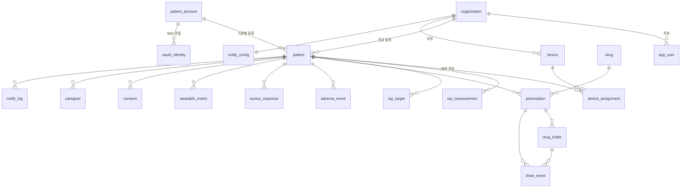

# 안압케어 데이터베이스 스키마

PostgreSQL 15+ 기준 / v1.0 / 2026-08

프런트엔드 프로토타입의 데이터 구조를 그대로 옮긴 스키마입니다. 화면에서 쓰는 필드명과 대응 관계를 각 절에 표기했습니다.

---

## 개체 관계



---

## 1. 공통 규약

- 기본키는 `BIGSERIAL`, 외부 노출용 식별자는 별도 `public_id VARCHAR(16)`(예: `P-1042`)
- 모든 시각은 `TIMESTAMPTZ`, 날짜만 필요한 경우 `DATE`
- 다중 기관 테이블은 `org_id BIGINT NOT NULL` + RLS 정책 적용
- 삭제는 `deleted_at`을 쓰는 소프트 삭제 (의료 기록 보존 의무)
- 식별정보 컬럼(`phone`, `email`, `birth`)은 애플리케이션 레벨 암호화 대상 — 아래 DDL은 평문 타입으로 표기하되 실제 구현 시 `BYTEA` + 블라인드 인덱스 병행

```sql
ALTER TABLE patient ENABLE ROW LEVEL SECURITY;
CREATE POLICY patient_org ON patient
  USING (org_id = current_setting('app.org_id')::BIGINT);
```

---

## 2. 기관 · 직원

```sql
CREATE TABLE organization (
  id            BIGSERIAL PRIMARY KEY,
  name          VARCHAR(120) NOT NULL,
  country       CHAR(2)      NOT NULL DEFAULT 'KR',
  timezone      VARCHAR(64)  NOT NULL DEFAULT 'Asia/Seoul',
  created_at    TIMESTAMPTZ  NOT NULL DEFAULT now(),
  deleted_at    TIMESTAMPTZ
);

CREATE TABLE app_user (                     -- 직원 계정
  id            BIGSERIAL PRIMARY KEY,
  public_id     VARCHAR(16)  NOT NULL UNIQUE,      -- U-01
  org_id        BIGINT       NOT NULL REFERENCES organization(id),
  email         VARCHAR(255) NOT NULL,
  password_hash TEXT         NOT NULL,             -- Argon2id
  name          VARCHAR(60)  NOT NULL,
  phone         VARCHAR(40),
  role          VARCHAR(16)  NOT NULL CHECK (role IN ('admin','physician','trainer')),
  is_active     BOOLEAN      NOT NULL DEFAULT true,
  last_login_at TIMESTAMPTZ,
  created_at    TIMESTAMPTZ  NOT NULL DEFAULT now(),
  deleted_at    TIMESTAMPTZ,
  UNIQUE (org_id, email)
);
```

---

## 3. 환자 계정 · 진료 등록

계정은 전역, 진료 등록은 기관 소속으로 분리합니다. 환자가 병원을 옮기거나 두 곳에 다녀도 측정 기록은 계정에 남습니다.

```sql
CREATE TABLE patient_account (              -- 로그인 주체
  id            BIGSERIAL PRIMARY KEY,
  login_id      VARCHAR(60)  UNIQUE,                -- 개별 가입 시
  password_hash TEXT,                               -- SNS 전용 계정은 NULL
  name          VARCHAR(60)  NOT NULL,
  gender        CHAR(1)      CHECK (gender IN ('M','F')),
  birth         DATE,
  phone         VARCHAR(40),
  email         VARCHAR(255),
  join_type     VARCHAR(16)  NOT NULL                -- 'local' | 'kakao' | 'naver'
                CHECK (join_type IN ('local','kakao','naver','google','apple',
                                     'facebook','wechat','weibo','qq')),
  country       CHAR(2)      NOT NULL DEFAULT 'KR',
  created_at    TIMESTAMPTZ  NOT NULL DEFAULT now(),
  deleted_at    TIMESTAMPTZ
);

CREATE TABLE oauth_identity (
  id            BIGSERIAL PRIMARY KEY,
  account_id    BIGINT       NOT NULL REFERENCES patient_account(id),
  provider      VARCHAR(16)  NOT NULL,
  provider_uid  VARCHAR(191) NOT NULL,
  linked_at     TIMESTAMPTZ  NOT NULL DEFAULT now(),
  UNIQUE (provider, provider_uid)
);

CREATE TABLE patient (                      -- 기관별 진료 등록
  id            BIGSERIAL PRIMARY KEY,
  public_id     VARCHAR(16)  NOT NULL UNIQUE,        -- P-1042
  org_id        BIGINT       NOT NULL REFERENCES organization(id),
  account_id    BIGINT       REFERENCES patient_account(id),  -- 미가입 등록 시 NULL
  chart_no      VARCHAR(40),                         -- 병원 차트번호
  diagnosis     VARCHAR(120),
  is_certified  BOOLEAN      NOT NULL DEFAULT false, -- 의료기관 인증 완료
  certified_at  TIMESTAMPTZ,
  certified_by  BIGINT       REFERENCES app_user(id),
  is_active     BOOLEAN      NOT NULL DEFAULT true,
  home_from     DATE,                                -- 홈 사용 기간
  home_to       DATE,
  created_at    TIMESTAMPTZ  NOT NULL DEFAULT now(),
  deleted_at    TIMESTAMPTZ,
  UNIQUE (org_id, account_id)
);
CREATE INDEX idx_patient_org_active ON patient(org_id, is_active) WHERE deleted_at IS NULL;

CREATE TABLE caregiver (                    -- 보호자
  id          BIGSERIAL PRIMARY KEY,
  patient_id  BIGINT       NOT NULL REFERENCES patient(id),
  name        VARCHAR(60)  NOT NULL,
  relation    VARCHAR(30),
  phone       VARCHAR(40)  NOT NULL,
  created_at  TIMESTAMPTZ  NOT NULL DEFAULT now()
);

CREATE TABLE consent (                      -- 동의 이력 (철회 포함)
  id          BIGSERIAL PRIMARY KEY,
  patient_id  BIGINT       NOT NULL REFERENCES patient(id),
  kind        VARCHAR(32)  NOT NULL,        -- 'data_share' | 'caregiver_notify' | 'marketing'
  granted     BOOLEAN      NOT NULL,
  granted_at  TIMESTAMPTZ  NOT NULL DEFAULT now(),
  source      VARCHAR(32)                   -- 'app_signup' | 'app_settings' | 'clinic'
);
CREATE INDEX idx_consent_latest ON consent(patient_id, kind, granted_at DESC);
```

---

## 4. 기기

소유 구분(`owner`)과 용도(`usage`)를 분리합니다. 병원 대여는 반납 관리 대상이고, 개인 소유는 연동 해제만 있습니다.

```sql
CREATE TABLE device (
  id          BIGSERIAL PRIMARY KEY,
  serial      VARCHAR(32)  NOT NULL UNIQUE,          -- CVT2H-2033AA11
  org_id      BIGINT       NOT NULL REFERENCES organization(id),
  name        VARCHAR(80)  NOT NULL,
  model       VARCHAR(32)  NOT NULL DEFAULT 'CVT200',
  owner       VARCHAR(8)   NOT NULL CHECK (owner IN ('org','patient')),
  usage       VARCHAR(8)   NOT NULL CHECK (usage IN ('clinic','home')),
  device_key  TEXT,                                  -- 업로드 인증 키(해시)
  battery     SMALLINT,
  firmware    VARCHAR(16),
  is_active   BOOLEAN      NOT NULL DEFAULT true,
  created_at  TIMESTAMPTZ  NOT NULL DEFAULT now()
);

CREATE TABLE device_assignment (            -- 대여·연동 이력
  id            BIGSERIAL PRIMARY KEY,
  device_id     BIGINT      NOT NULL REFERENCES device(id),
  patient_id    BIGINT      NOT NULL REFERENCES patient(id),
  kind          VARCHAR(8)  NOT NULL CHECK (kind IN ('rental','owned')),
  rent_from     DATE,                                -- kind='rental'
  rent_to       DATE,
  returned_at   TIMESTAMPTZ,
  linked_at     TIMESTAMPTZ,                         -- kind='owned'
  unlinked_at   TIMESTAMPTZ,
  assigned_by   BIGINT      REFERENCES app_user(id),
  created_at    TIMESTAMPTZ NOT NULL DEFAULT now()
);
-- 한 기기가 동시에 두 환자에게 배정되지 않도록
CREATE UNIQUE INDEX uq_device_active_assign ON device_assignment(device_id)
  WHERE returned_at IS NULL AND unlinked_at IS NULL;
CREATE INDEX idx_assign_patient ON device_assignment(patient_id, created_at DESC);
```

**반납 상태 판정**은 뷰로 제공합니다.

```sql
CREATE VIEW v_rental_status AS
SELECT a.device_id, a.patient_id, a.rent_to,
       (a.rent_to - CURRENT_DATE) AS days_left,
       CASE
         WHEN a.rent_to IS NULL                       THEN 'not_rental'
         WHEN CURRENT_DATE - a.rent_to > 3            THEN 'blocked'
         WHEN CURRENT_DATE > a.rent_to                THEN 'overdue'
         WHEN a.rent_to - CURRENT_DATE = 0            THEN 'due_today'
         WHEN a.rent_to - CURRENT_DATE <= 3           THEN 'due_soon'
         ELSE 'active'
       END AS status
FROM device_assignment a
WHERE a.kind = 'rental' AND a.returned_at IS NULL;
```

---

## 5. 안압 측정

좌·우안을 **개별 행**으로 저장합니다. 한쪽만 측정한 경우가 정상 케이스이므로 한 행에 od/os를 함께 두지 않습니다.

```sql
CREATE TABLE iop_measurement (
  id              BIGSERIAL PRIMARY KEY,
  org_id          BIGINT      NOT NULL,
  patient_id      BIGINT      NOT NULL REFERENCES patient(id),
  device_id       BIGINT      REFERENCES device(id),
  measurement_uid VARCHAR(64),                       -- 기기 생성 멱등키
  measured_at     TIMESTAMPTZ NOT NULL,
  eye             CHAR(2)     NOT NULL CHECK (eye IN ('OD','OS')),
  value_mmhg      NUMERIC(4,1) NOT NULL CHECK (value_mmhg BETWEEN 1 AND 80),
  quality         VARCHAR(12) CHECK (quality IN ('excellent','good','retake')),
  source          VARCHAR(8)  NOT NULL CHECK (source IN ('auto','manual')),
  context         VARCHAR(24),                       -- '기상 직후' 등
  is_excluded     BOOLEAN     NOT NULL DEFAULT false,
  excluded_by     BIGINT      REFERENCES app_user(id),
  excluded_at     TIMESTAMPTZ,
  created_at      TIMESTAMPTZ NOT NULL DEFAULT now()
);
CREATE UNIQUE INDEX uq_meas_uid ON iop_measurement(device_id, measurement_uid)
  WHERE measurement_uid IS NOT NULL;
CREATE INDEX idx_meas_patient_time ON iop_measurement(patient_id, measured_at DESC)
  WHERE is_excluded = false;

CREATE TABLE iop_target (                   -- 목표 안압 변경 이력
  id            BIGSERIAL PRIMARY KEY,
  patient_id    BIGINT      NOT NULL REFERENCES patient(id),
  target_od     SMALLINT    NOT NULL,
  target_os     SMALLINT    NOT NULL,
  effective_from DATE       NOT NULL DEFAULT CURRENT_DATE,
  set_by        BIGINT      REFERENCES app_user(id),
  created_at    TIMESTAMPTZ NOT NULL DEFAULT now()
);
```

측정 건수가 환자당 수천 건으로 늘어나므로 `measured_at` 기준 **월 단위 파티셔닝**을 권장합니다.

---

## 6. 점안 · 순응도

### 6.1 약제 마스터 · 처방

```sql
CREATE TABLE drug (
  id          BIGSERIAL PRIMARY KEY,
  name        VARCHAR(80)  NOT NULL,
  ingredient  VARCHAR(120) NOT NULL,
  maker       VARCHAR(80),
  drug_class  VARCHAR(16)  CHECK (drug_class IN ('PG','BB','CAI','A2','AT','ETC')),
  dose_form   VARCHAR(8)   CHECK (dose_form IN ('multi','single')),  -- 다회용/일회용
  open_life_days SMALLINT  DEFAULT 28,               -- 개봉 후 사용기한
  is_active   BOOLEAN      NOT NULL DEFAULT true
);

CREATE TABLE prescription (
  id            BIGSERIAL PRIMARY KEY,
  org_id        BIGINT      NOT NULL,
  patient_id    BIGINT      NOT NULL REFERENCES patient(id),
  drug_id       BIGINT      NOT NULL REFERENCES drug(id),
  eye           VARCHAR(4)  NOT NULL CHECK (eye IN ('OD','OS','both')),
  is_prn        BOOLEAN     NOT NULL DEFAULT false,  -- 필요 시
  times         TIME[]      NOT NULL DEFAULT '{}',   -- {08:00, 20:00}
  start_date    DATE        NOT NULL,
  end_date      DATE,
  prescriber_id BIGINT      REFERENCES app_user(id),
  created_at    TIMESTAMPTZ NOT NULL DEFAULT now()
);
CREATE INDEX idx_rx_active ON prescription(patient_id)
  WHERE end_date IS NULL OR end_date >= CURRENT_DATE;

CREATE TABLE drug_bottle (                  -- 약병 단위 관리
  id            BIGSERIAL PRIMARY KEY,
  prescription_id BIGINT    NOT NULL REFERENCES prescription(id),
  opened_at     DATE,                              -- 다회용
  discard_at    DATE,                              -- opened_at + open_life_days
  drops_total   SMALLINT,                          -- 다회용 총 방울 수 (5mL ≈ 100)
  drops_used    SMALLINT    NOT NULL DEFAULT 0,
  units_left    SMALLINT,                          -- 일회용 잔여 앰플
  is_current    BOOLEAN     NOT NULL DEFAULT true,
  created_at    TIMESTAMPTZ NOT NULL DEFAULT now()
);
CREATE UNIQUE INDEX uq_bottle_current ON drug_bottle(prescription_id) WHERE is_current;
```

### 6.2 점안 이벤트 — 순응도의 유일한 출처

**예약 행 방식**입니다. 매일 자정 배치가 다음 날 분을 `taken=false`로 미리 만들고, 환자가 체크하면 갱신합니다. 이렇게 해야 분모(예정)와 분자(실행)가 명확합니다.

```sql
CREATE TABLE dose_event (
  id              BIGSERIAL PRIMARY KEY,
  org_id          BIGINT      NOT NULL,
  patient_id      BIGINT      NOT NULL REFERENCES patient(id),
  prescription_id BIGINT      NOT NULL REFERENCES prescription(id),
  bottle_id       BIGINT      REFERENCES drug_bottle(id),
  scheduled_date  DATE        NOT NULL,
  scheduled_time  TIME        NOT NULL,
  eye             CHAR(2)     NOT NULL CHECK (eye IN ('OD','OS')),
  taken           BOOLEAN     NOT NULL DEFAULT false,
  taken_at        TIMESTAMPTZ,
  source          VARCHAR(8)  CHECK (source IN ('device','manual')),
  created_at      TIMESTAMPTZ NOT NULL DEFAULT now(),
  UNIQUE (prescription_id, scheduled_date, scheduled_time, eye)
);
CREATE INDEX idx_dose_patient_date ON dose_event(patient_id, scheduled_date);
CREATE INDEX idx_dose_missed ON dose_event(patient_id, scheduled_date)
  WHERE taken = false;
```

`UNIQUE` 제약이 중복 생성과 중복 체크를 동시에 막습니다. 프런트엔드의 `DOSE_LOG` 한 행이 이 테이블 한 행에 그대로 대응합니다.

### 6.3 집계 요약

```sql
CREATE TABLE adherence_daily (              -- 야간 배치 적재
  patient_id  BIGINT  NOT NULL REFERENCES patient(id),
  date        DATE    NOT NULL,
  total       SMALLINT NOT NULL,
  taken       SMALLINT NOT NULL,
  pct         SMALLINT NOT NULL,
  PRIMARY KEY (patient_id, date)
);
```

기간별·약제별·시각별·요일별 집계는 이 테이블과 `dose_event`를 조합해 조회 시점에 계산합니다.

```sql
-- 약제별 순응도 (기간 지정)
SELECT d.name,
       COUNT(*)                                   AS total,
       COUNT(*) FILTER (WHERE de.taken)           AS taken,
       ROUND(100.0 * COUNT(*) FILTER (WHERE de.taken) / COUNT(*)) AS pct
FROM dose_event de
JOIN prescription p ON p.id = de.prescription_id
JOIN drug d         ON d.id = p.drug_id
WHERE de.patient_id = $1 AND de.scheduled_date BETWEEN $2 AND $3
GROUP BY d.name
ORDER BY pct;
```

### 6.4 부작용

```sql
CREATE TABLE adverse_event (
  id              BIGSERIAL PRIMARY KEY,
  org_id          BIGINT      NOT NULL,
  patient_id      BIGINT      NOT NULL REFERENCES patient(id),
  prescription_id BIGINT      REFERENCES prescription(id),
  eye             VARCHAR(4)  NOT NULL CHECK (eye IN ('OD','OS','both')),
  symptoms        TEXT[]      NOT NULL,
  severity        VARCHAR(8)  NOT NULL CHECK (severity IN ('mild','moderate','severe')),
  note            TEXT,
  reported_at     TIMESTAMPTZ NOT NULL DEFAULT now(),
  reviewed_by     BIGINT      REFERENCES app_user(id),
  reviewed_at     TIMESTAMPTZ
);
CREATE INDEX idx_ae_patient ON adverse_event(patient_id, reported_at DESC);
```

원인 분석은 이 테이블의 `reported_at`을 기준으로 `dose_event`의 전후 순응도를 비교합니다.

---

## 7. 문진 · 워치

```sql
CREATE TABLE survey_response (
  id           BIGSERIAL PRIMARY KEY,
  patient_id   BIGINT      NOT NULL REFERENCES patient(id),
  question_id  VARCHAR(8)  NOT NULL,        -- 'Q1', 'Q6-2'
  answer       JSONB       NOT NULL,        -- 단일/복수/pack-year 모두 수용
  risk         VARCHAR(4),                  -- '저'|'중'|'고'|'-'
  answered_at  TIMESTAMPTZ NOT NULL DEFAULT now()
);
CREATE INDEX idx_survey_latest ON survey_response(patient_id, question_id, answered_at DESC);

CREATE TABLE wearable_metric (
  id          BIGSERIAL PRIMARY KEY,
  patient_id  BIGINT      NOT NULL REFERENCES patient(id),
  date        DATE        NOT NULL,
  platform    VARCHAR(12) CHECK (platform IN ('apple','galaxy','other')),
  metric      VARCHAR(24) NOT NULL,         -- 'steps','sleep_min','resting_hr','irn'
  value       NUMERIC(10,2),
  meta        JSONB,
  UNIQUE (patient_id, date, metric)
);
```

문진은 항목이 바뀌어도 스키마를 고치지 않도록 `JSONB` 답변으로 받습니다. 질문 정의는 애플리케이션 코드 또는 별도 `survey_question` 마스터에 둡니다.

---

## 8. 알림 · 감사 로그

```sql
CREATE TABLE notify_config (                -- 기관별 알림 설정
  org_id        BIGINT PRIMARY KEY REFERENCES organization(id),
  rent_enabled  BOOLEAN NOT NULL DEFAULT true,
  run_at        TIME    NOT NULL DEFAULT '09:00',
  grace_days    SMALLINT NOT NULL DEFAULT 3,
  resend_daily  BOOLEAN NOT NULL DEFAULT true,
  quiet_hours   BOOLEAN NOT NULL DEFAULT true,
  retry_limit   SMALLINT NOT NULL DEFAULT 2,
  channels      JSONB   NOT NULL,           -- 단계별 push/sms/call
  adh_enabled   BOOLEAN NOT NULL DEFAULT true,
  adh_window    SMALLINT NOT NULL DEFAULT 14,
  adh_watch     SMALLINT NOT NULL DEFAULT 90,
  adh_warn      SMALLINT NOT NULL DEFAULT 80,
  adh_crit      SMALLINT NOT NULL DEFAULT 70,
  adh_streak    SMALLINT NOT NULL DEFAULT 3,
  updated_by    BIGINT REFERENCES app_user(id),
  updated_at    TIMESTAMPTZ NOT NULL DEFAULT now()
);

CREATE TABLE notify_log (                   -- 불변 감사 로그
  id              BIGSERIAL PRIMARY KEY,
  org_id          BIGINT      NOT NULL,
  patient_id      BIGINT      NOT NULL,
  device_serial   VARCHAR(32),
  category        VARCHAR(12) NOT NULL CHECK (category IN ('rental','adherence','bottle')),
  level           VARCHAR(16) NOT NULL,     -- d3|d1|d0|overdue|blocked|watch|warn|crit
  channel         VARCHAR(8)  NOT NULL CHECK (channel IN ('push','sms','call')),
  mode            VARCHAR(8)  NOT NULL CHECK (mode IN ('auto','manual')),
  actor           VARCHAR(64) NOT NULL,     -- '스케줄러' 또는 직원명
  result          VARCHAR(8)  NOT NULL CHECK (result IN ('success','partial','fail')),
  provider_msg_id VARCHAR(128),
  error_code      VARCHAR(64),
  detail          TEXT,
  sent_at         TIMESTAMPTZ NOT NULL DEFAULT now()
);
CREATE UNIQUE INDEX uq_notify_daily ON notify_log
  (device_serial, level, channel, mode, (sent_at::date));
CREATE INDEX idx_notify_org_time ON notify_log(org_id, sent_at DESC);

CREATE TABLE access_log (                   -- 환자 데이터 접근 감사
  id          BIGSERIAL PRIMARY KEY,
  org_id      BIGINT      NOT NULL,
  user_id     BIGINT      REFERENCES app_user(id),
  patient_id  BIGINT,
  action      VARCHAR(32) NOT NULL,         -- 'view','update','export','exclude'
  target      VARCHAR(64),
  ip          INET,
  user_agent  TEXT,
  at          TIMESTAMPTZ NOT NULL DEFAULT now()
);

CREATE TABLE job_run (                      -- 배치 실행 기록
  id          BIGSERIAL PRIMARY KEY,
  org_id      BIGINT,
  job         VARCHAR(48) NOT NULL,
  started_at  TIMESTAMPTZ NOT NULL,
  finished_at TIMESTAMPTZ,
  status      VARCHAR(12) NOT NULL,
  processed   INTEGER,
  detail      JSONB
);
```

`notify_log`와 `access_log`는 애플리케이션 DB 롤에서 UPDATE·DELETE 권한을 회수합니다.

```sql
REVOKE UPDATE, DELETE ON notify_log, access_log FROM app_role;
```

---

## 9. 보존 정책

| 데이터 | 보존 | 근거 |
|---|---|---|
| 측정·점안·처방 기록 | 진료기록 준용, 최소 10년 | 의료법 |
| 알림 발송 로그 | 3년 이상 | 기관 정책 · 분쟁 대응 |
| 접근 감사 로그 | 3년 | HIPAA 6년 요구 시 지역별 조정 |
| 비회원 데이터 | 서버 저장 없음 | — |
| 탈퇴 계정 | 식별정보 즉시 파기, 측정 기록은 익명화 후 보존 | GDPR 삭제권과 의료 보존 의무의 절충 |

탈퇴 시 `patient_account`의 식별정보를 파기하고 `patient` 행은 익명 상태로 남깁니다. 진료 기록 자체는 지울 수 없으므로 연결 고리만 끊는 방식입니다.
